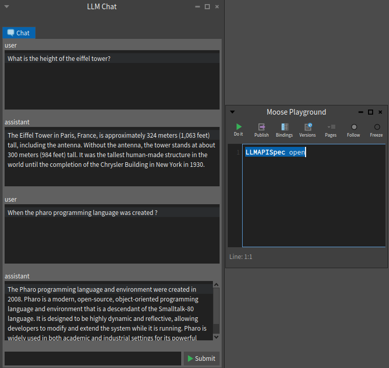

# Pharo LLM API

## Installation

```st
Metacello new
  githubUser: 'Evref-BL' project: 'Pharo-LLMAPI' commitish: 'main' path: 'src';
  baseline: 'LLMAPI';
  load
```

## Example

### For the chat

```st
api := LLMAPI chat.
api host: 'api.mistral.ai'.
api apiKey: '<apiKey>'.

api payload
	temperature: 0.5;
	model: 'mistral-small-latest';
	top_p: 1;
	max_tokens: 250;
	messages: {
		LLMAPIChatObjectMessage role: 'system' content: 'You are a usefull assistant'.
		LLMAPIChatObjectMessage role: 'user' content: 'How to write hello world in Pharo?'.
		 }.

result := api performRequest.
```

#### Using tools (function call)

You can also create code that will be called by the LLM.
It is named function call or function tool.

```st
api := LLMAPI chat.
api host: 'api.mistral.ai'.

api payload
	temperature: 0.5;
	model: 'mistral-small-latest';
	top_p: 1;
	max_tokens: 250;
	tools: { (LLMAPIChatObjectToolCountClasses new) };
	messages: {
			(LLMAPIChatObjectMessage
				 role: 'system'
				 content: 'You are a usefull assistant').
			(LLMAPIChatObjectMessage
				 role: 'user'
				 content: 'What is the number of classes in my computer ? ') }.

result := api performRequest.

```

### For the FIM

```st
api := LLMAPI fim.
api host: 'api.mistral.ai'.
api apiKey: '<apiKey>'.

api payload
	temperature: 0.2;
	model: 'codestral-2405';
	top_p: 1;
	max_tokens: 250;
	prompt: 'def';
	suffix: 'return a + b'.
result := api performRequest.
```

## UI

This project also includes a simple UI. Feel free to use it, improve it, and contribute.

Open it with:

```st
LLMAPISpec open
```


